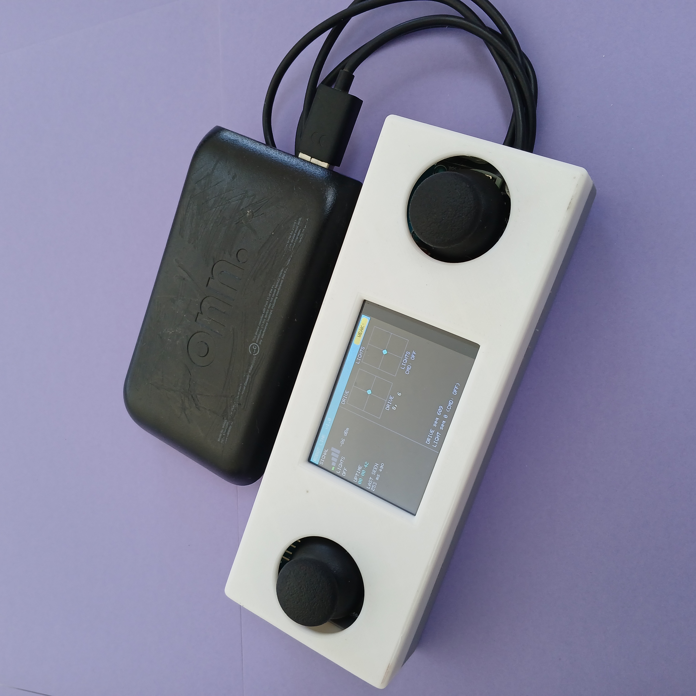

# Dual Analog Stick Controller 🕹️🕹️



Two-handed controller for the robot: an ESP32, two analog thumbsticks, and a small (~2") TFT screen in a 3D-printed enclosure. Left stick drives the robot; right stick works the lights; the screen is a live HUD fed by the robot's heartbeat — link quality, confirmed relay state, robot uptime, and a crosshair readout for each stick.

Like the single stick controller, there's no onboard battery — it runs off its USB cable, so plug it into a pocket USB battery pack in the field or a phone charger at the bench.

## Controls

- **Left stick — drive.** Streams to the motor receiver continuously. The robot fail-safe stops if the stream goes quiet.
- **Right stick — lights, as a flick switch.** Flick forward to latch headlights on, back to latch them off; flick left/right to fire a 2-second turn signal. Edge-triggered with a release threshold, so holding a direction doesn't repeat-fire.

## HUD

The robot sends a heartbeat every ~500 ms; the screen renders it at 30 fps. Link badge (LINKED / WEAK / NO LINK) and signal bars come from the controller's own RSSI reading of the heartbeat. The LIGHTS field shows the robot's *confirmed* relay state from the heartbeat, not just the last command sent — if the robot didn't get the flick, the HUD says so. Everything goes stale-gray after 1 second without a heartbeat.

## Protocol

ESP-NOW, channel 1, three packet types told apart purely by length:

```c
typedef struct __attribute__((packed)) {
  uint16_t x;   // 0–4095
  uint16_t y;   // 0–4095
  uint32_t seq;
  uint32_t ms;  // sender uptime
} JoyPacket;    // 12 bytes — drive, sent every 5 ms to the motor receiver

typedef struct __attribute__((packed)) {
  uint8_t  cmd; // 0 off, 1 on, 2 turn left, 3 turn right
  uint32_t seq;
} LightPacket;  // 5 bytes — one-shot event, burst-sent 3x to the relay receiver

typedef struct __attribute__((packed)) {
  int8_t   rssi;       // robot's RSSI reading of the controller, dBm
  uint8_t  relayState; // 0 off, 1 on
  uint32_t uptimeMs;
  uint32_t seq;
} HeartbeatPacket;     // 10 bytes — robot → controller, every ~500 ms
```

Drive packets are fire-and-forget — a dropped packet is superseded 5 ms later. Light commands are one-shot events, so instead of waiting on an ACK they're burst-sent 3 times, 15 ms apart, with a sequence number so the receiver can dedupe.

Firmware: [`firmware/dual_analog_stick.ino`](../../firmware/dual_analog_stick.ino). Plain Arduino; the only libraries beyond `esp_now.h` are for driving the screen. Retarget it by changing two MAC addresses — motor receiver and relay receiver.

## Build docs

- [Bill of materials](dual_bom.pdf)
- [Wiring diagram](dual_wiring_diagram.png)
- [Protocol details](dual_protocol.pdf)
- [STL files](stl_for_dual.md)
