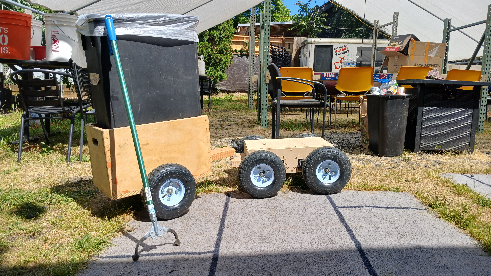

# The Robot 🤖

Human-scale differential-drive utility robot built from ride-on toy parts: 550-type brushed motors with 100:1 gearboxes on 10-inch pneumatic wheels, powered by 12 V 7 Ah sealed lead-acid, driven by BTS7960 H-bridges. Ride-on toy drivetrains are cheap, everywhere, and geared for exactly this job — high torque at walking speed. The pneumatic tires handle sidewalks, ramps, and grass without any suspension, and it'll tow a cart.

## Architecture

There's no single robot brain — it's two independent ESP32s, each listening on ESP-NOW:

- **Motor board** ([`firmware/skidsteer_espnow.ino`](../../firmware/skidsteer_espnow.ino)) — receives the drive stream, does the skid-steer mixing, runs four BTS7960 channels.
- **Relay board** ([`firmware/relay_receiver.ino`](../../firmware/relay_receiver.ino)) — receives light events, drives two relays (left/right lights) for latched headlights and 2-second momentary turn signals.

Receivers tell packets apart purely by length (12-byte drive, 5-byte light event), so both boards can share the airwaves without a header byte or any routing. Anything that speaks the protocol can drive it — the single stick, the dual stick, or a computer through a reflashed controller — and switching between manual and auto control never involves touching a cord.

## Drive behavior

The motor board turns the joystick stream into arcade-mixed skid steer (throttle ± turn), with two safety behaviors worth knowing:

- **Fail-safe stop.** If no drive packet arrives for 300 ms, targets go to zero. The controller streams every 5 ms, so this only trips when the link is actually gone.
- **Ramping.** Motor output moves toward the target 1 PWM count every 3 ms (~0 to full in 0.75 s), so a stick flick doesn't dump full torque into the drivetrain — and the fail-safe stop is a controlled ramp-down, not a faceplant.

There's also a ~20% stick deadzone in the mixer, so the robot stays genuinely still at center.

## Lights

The relay board latches headlights on/off and fires momentary turn signals, deduping the controller's burst-resends by sequence number. A turn signal on one side never touches the other side's relay, and when it expires the relay reverts to the headlight state. Every ~500 ms it sends a heartbeat back (RSSI, relay state, uptime) — that's what feeds the dual stick controller's HUD. Controllers are auto-registered: first packet heard from a MAC becomes the peer, no pairing step.

## Build docs

- [Bill of materials](robot_bom.pdf)
- [Wiring diagram](robot_wiring_diagram.png)
- [Protocol details](robot_protocol.pdf)
- [STL files](stl_for_robot.md)
