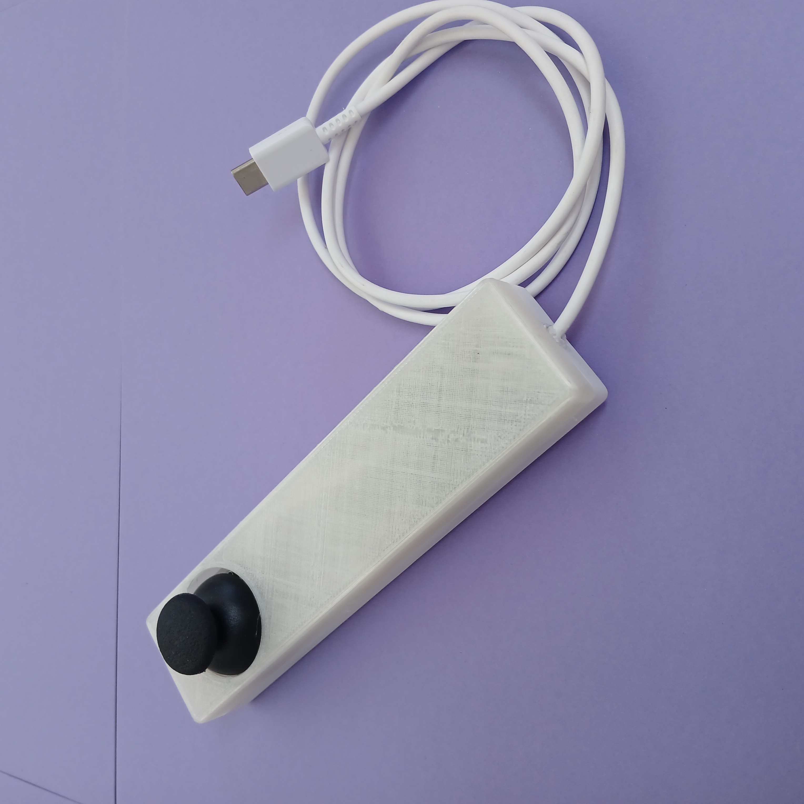

# Single Analog Stick Controller 🕹️



One-handed controller for the robot: an ESP32, an analog thumbstick, and a 3D-printed enclosure. Thumb handles steering and throttle; clicking the stick cycles the speed cap 25% → 50% → 75% → 100%. Driving one-handed leaves your other hand free to load items onto the robot, hold a coffee, or open doors.

There's no onboard battery — the controller runs off its USB-C cable, so plug it into a pocket USB battery pack in the field, or any phone charger at the bench.

## USB-C goes straight to the ESP32

The USB-C port is wired to the ESP32's USB interface, not just power. Plug the controller into a computer and you have serial and flashing access — no disassembly, no test pads, no jig. So:

- Reflash it as a serial-to-ESP-NOW bridge and drive the robot from any computer that can open a serial port. Flash the stock firmware back when done.
- Need an ESP32 for a minute? This is one, in a case.

## Protocol

ESP-NOW, channel 1, addressed to the robot's MAC. Packets every 5 ms:

```c
typedef struct __attribute__((packed)) {
  uint16_t x;    // 0–4095, center 2048
  uint16_t y;    // 0–4095, center 2048
  uint32_t seq;  // packet counter
  uint32_t ms;   // sender uptime
} JoyPacket;
```

Stick auto-centers on boot, ±40-count deadband. Speed scaling happens sender-side, so the packet carries final values and the robot firmware stays simple. `seq`/`ms` let the receiver drop stale packets.

Firmware is ~100 lines of plain Arduino, no libraries beyond `esp_now.h`: [`firmware/single_analog_stick_espnow.ino`](../../firmware/single_analog_stick_espnow.ino). Retarget it by changing one MAC address.

## Build docs

- [Bill of materials](single_bom.pdf)
- [Wiring diagram](single_wiring_diagram.png) — three analog pins plus power
- [Protocol details](single_protocol.pdf)
- [STL files](stl_for_signle_stick.md)
